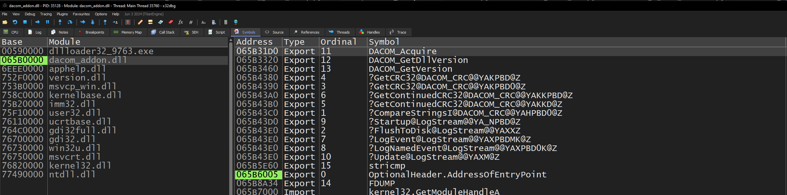

# Генерация Proxy DLL

Этот проект позволяет сгенерировать **proxy DLL проект** для существующей Windows-библиотеки на основе:

- **дампа функций**, экспортированного из Ghidra
- **реального списка экспортов**, полученного из x32dbg

На выходе вы получаете **готовый C/C++ proxy DLL проект**, который можно собрать и использовать как обёртку над оригинальной библиотекой.

---

## Что потребуется заранее

Перед началом убедитесь, что у вас установлены:

- [Python 3](https://www.python.org/)
- [Ghidra](https://github.com/nationalsecurityagency/ghidra)
- [x32dbg](https://github.com/x64dbg/x64dbg)
- **Microsoft Visual C++ Toolkit 2003** _(рекомендуется для старых legacy DLL)_
- **Microsoft Platform SDK for Windows Server 2003 R2**

> [!NOTE]
> Если вы работаете со старой игрой или legacy x86 бинарником, использование оригинального toolchain может быть критично для ABI-совместимости.

---

## Общий пайплайн

```text
Ghidra -> functions_dump.c -> overrides.json
x32dbg -> exports.md
exports.md + overrides.json -> generated_proxy/
generated_proxy/ -> build -> proxy DLL
```

---

## 1. Формирование дампа функций из Ghidra

Сначала нужно экспортировать распознанные функции из целевой DLL через **Ghidra**.

### Шаги

1. Откройте DLL в **Ghidra**
2. Выполните экспорт программы:
   - `File`
   - `-> Export Program`
   - `-> Format -> C/C++`
   - `-> Output File -> functions_dump.c`

### Зачем нужен этот файл

Этот дамп используется для извлечения:

- возвращаемых типов функций
- calling convention
- типов параметров
- внутренних сигнатур функций

> [!IMPORTANT]
> `functions_dump.c` — это **не таблица реальных экспортов DLL**.
> Это только decompile-дамп функций, который смогла определить Ghidra.

### Пример

```c
undefined1 * __fastcall FUN_065b13e0(undefined1 *param_1)

{
  int iVar1;
  undefined1 local_1;

  local_1 = (undefined1)((uint)param_1 >> 0x18);
  *param_1 = local_1;
  iVar1 = FUN_065b5ece();
  *(int *)iVar1 = iVar1;
  *(int *)(iVar1 + 4) = iVar1;
  *(int *)(param_1 + 4) = iVar1;
  *(undefined4 *)(param_1 + 8) = 0;
  FUN_065b1480(param_1,0);
  return param_1;
}
```

---

## 2. Генерация `overrides.json`

После получения `functions_dump.c` нужно сгенерировать карту сигнатур функций.

### Команда

```sh
python generate_overrides_from_ghidra_dump.py functions_dump.c overrides.json
```

### Аргументы

- `functions_dump.c` — дамп функций из Ghidra
- `overrides.json` — выходной JSON-файл с метаданными функций

### Зачем нужен этот файл

`overrides.json` помогает генератору понять:

- тип возвращаемого значения
- calling convention (`__cdecl`, `__stdcall`, `__fastcall`)
- параметры
- специальные случаи вроде data exports и проблемных символов

> [!WARNING]
> Ghidra может экспортировать **мусорные или невалидные символы**, например:
>
> - `OptionalHeader.AddressOfEntryPoint`
> - CRT-символы вроде `stricmp`
> - внутренние helper-метки
> - data exports
>
> Такие вещи иногда требуют ручной корректировки в `overrides.json`.

### Пример [overrides.json](examples/overrides.json)

```json
{
	"FDUMP": { "kind": "data_export" },
	"stricmp": {
		"kind": "c_export",
		"return_type": "int",
		"calling_convention": "__cdecl",
		"params": [
			{ "type": "const char*", "name": "str1" },
			{ "type": "const char*", "name": "str2" }
		]
	}
}
```

---

## 3. Формирование реального списка экспортов `exports.md`

Теперь нужно отдельно получить **настоящий список экспортируемых символов DLL**.

### Как сделать через x32dbg

1. Откройте целевую DLL в **x32dbg** _(x86, если библиотека 32-битная)_
2. Перейдите во вкладку:
   - `Symbols`

3. Выберите загруженную DLL
4. Скопируйте список экспортов
   - Справа будет список экспортируемых функций
     - 
5. Сохраните его в файл:

```text
exports.md
```

6. Пример содержимого - [exports.md](examples/exports.md)

> [!IMPORTANT]
> `exports.md` — это **источник истины** для того, что DLL реально экспортирует наружу.

> [!NOTE]
> Ghidra decompile и PE exports — это **не одно и то же**.
> Для финальной генерации proxy DLL всегда ориентируйтесь на export table из x32dbg / PE-метаданных.

---

## 4. Генерация проекта proxy DLL

Когда у вас есть:

- `exports.md`
- `overrides.json`

можно сгенерировать сам проект proxy DLL.

### Команда

```sh
python reverse_dll_project_generator.py exports.md -o generated_proxy --dll-name dacom --original-dll dacom_addon.dll --overrides overrides.json
```

### Аргументы

- `exports.md` — список экспортов из x32dbg
- `-o generated_proxy` — папка, куда будет сгенерирован проект
- `--dll-name dacom` — имя исходной DLL, которую вы клонируете
- `--original-dll dacom_addon.dll` — имя, под которым будет лежать переименованная оригинальная DLL
- `--overrides overrides.json` — карта сигнатур, полученная из Ghidra

### Результат

Будет создана новая папка:

```text
generated_proxy/
```

Внутри неё вы получите:

- сгенерированные C/C++ исходники proxy DLL
- `.def` файл
- код загрузки оригинальной библиотеки
- заголовки
- `build.bat`

---

## 5. Сборка проекта

Если целевая DLL старая, для совместимости может понадобиться старый компилятор.

Рекомендуемый toolchain для старых бинарников:

- **Microsoft Visual C++ Toolkit 2003**
- **Microsoft Platform SDK for Windows Server 2003 R2**

---

## 6. Подготовка окружения VC71

Рядом с `build.bat` создайте файл:

```text
vc71_env.bat
```

### Пример содержимого [vc71_env.bat](examples/vc71_env.bat)

```bat
@echo off
set VC71=C:\Program Files (x86)\Microsoft Visual C++ Toolkit 2003
set SDK=C:\Program Files\Microsoft Platform SDK for Windows Server 2003 R2\

set PATH=%VC71%\bin;%SDK%\Bin;%PATH%
set INCLUDE=%VC71%\include;%SDK%\Include
set LIB=%VC71%\lib;%SDK%\Lib

echo =====================================
echo VC71 + Platform SDK environment ready
echo =====================================
cmd
```

### Что нужно заменить

Подставьте свои локальные пути:

- `VC71=<ваш путь>`
- `SDK=<ваш путь>`

### Полезные ссылки

- [Microsoft Visual C++ Toolkit 2003](https://archive.org/details/microsoft-visual-c-toolkit-2003)
- [Microsoft Platform SDK for Windows Server 2003 R2](https://archive.org/details/platform-sdk-for-microsoft-windows-server-2003-r2-march-2006-edition-english)

---

## 7. Сборка DLL

1. Выполните:

```bat
vc71_env.bat
```

2. Затем выполните:

```bat
build.bat
```

Если всё прошло успешно, итоговая DLL появится в папке:

```text
build/
```

---

## 8. Подмена оригинальной DLL

Теперь нужно правильно разложить файлы.

### Пример

Допустим, оригинальная библиотека называлась:

```text
dacom.dll
```

### Шаги

1. Переименуйте оригинальную DLL в:

```text
dacom_addon.dll
```

2. Положите рядом оба файла:

```text
dacom.dll          <- новая proxy DLL
dacom_addon.dll    <- оригинальная переименованная DLL
```

> [!IMPORTANT]
> `dacom_addon.dll` — это просто пример имени.
> Вы можете использовать любое своё название, но оно **обязательно должно совпадать** со значением, переданным в:

```sh
--original-dll dacom_addon.dll
```

---

## Важные замечания

### 1. Не все экспорты одинаково простые

Некоторые экспорты могут быть:

- `__stdcall`
- `__cdecl`
- C++ mangled names
- перегруженные функции
- data exports
- CRT / runtime symbols

Поэтому иногда потребуется ручная корректировка:

- `overrides.json`
- сгенерированных сигнатур
- `.def` файла
- proxy-обёрток

---

### 2. Ghidra не всегда правильно определяет сигнатуры

При необходимости проверяйте вручную:

- calling convention
- return type
- количество параметров
- смысл mangled name

Полезные инструменты:

- Ghidra
- x32dbg
- PE-bear
- dumpbin
- Dependency Walker

---

### 3. Первый результат почти всегда требует ручной доработки

Этот проект создан для того, чтобы **ускорить реконструкцию proxy DLL**, а не гарантировать идеальную 100% автоматическую пересборку.

Он особенно полезен как основа для:

- reverse engineering
- runtime wrapping
- восстановления export-таблиц
- ABI-совместимых proxy-слоёв

---
